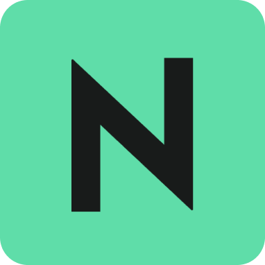
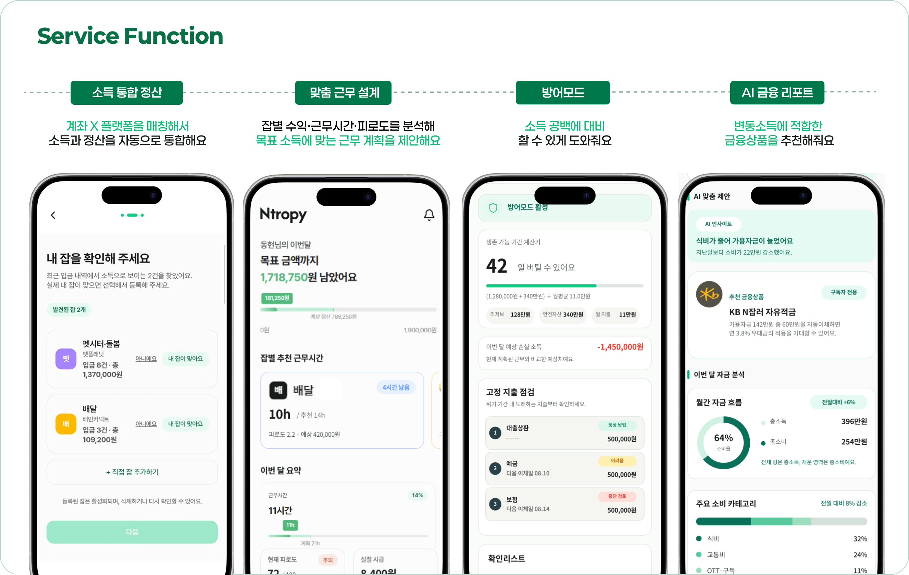
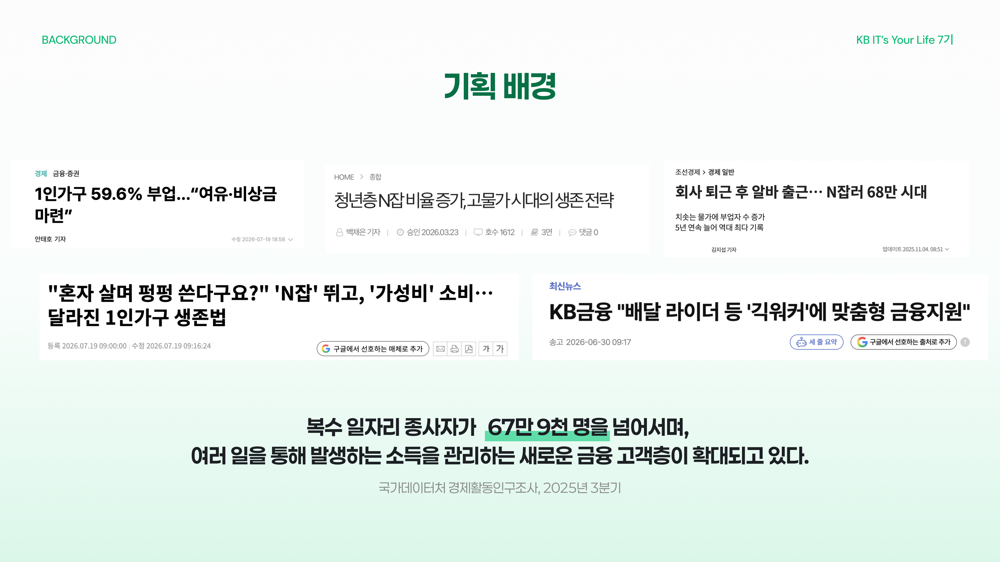
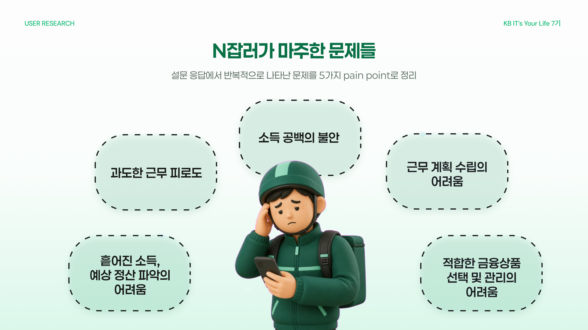
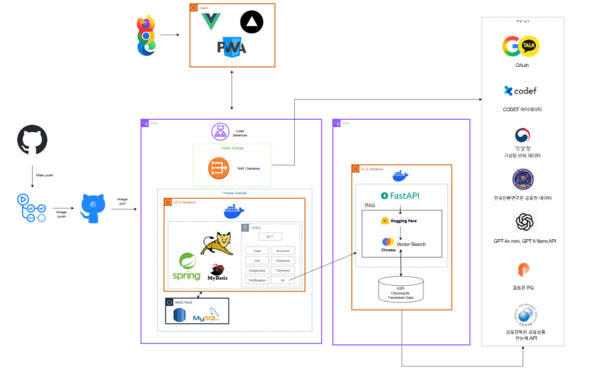
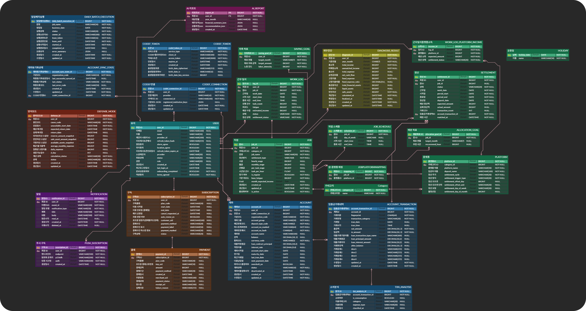

  

<h1 align="center">N트로피</h1>
<h3 align="center">N잡러의 지속 가능한 자산 관리를 위한 금융 매니저</h3>

  흩어진 근무와 금융 데이터를 한곳에 모아 
  오늘의 수입부터 내일의 재무 계획까지 체계적으로 관리합니다.

  <a href="https://kbntropy.vercel.app"><strong>🌐 서비스 바로가기</strong></a>
  &nbsp;&nbsp;|&nbsp;&nbsp;
  <a href="https://www.youtube.com/watch?v=qjZMiiO7CHE"><strong>🎬 시연 영상 보기</strong></a>

 

## 📌 프로젝트 정보

> 🏆 **KB IT's Your Life 7기 최우수 프로젝트**

| 김동현 (팀장) | 김기선 | 박신형 | 장아연 | 조수현 | 한재윤 |
| :---: | :---: | :---: | :---: | :---: | :---: |
|  |  |  |  |  |  |
| [@Kimd0ng](https://github.com/Kimd0ng) | [@kskim](https://github.com/kskim) | [@shinh09](https://github.com/shinh09) | [@bigwaveBigwave](https://github.com/bigwaveBigwave) | [@SOOsuhyuncho](https://github.com/SOOsuhyuncho) | [@hanjyoon01](https://github.com/hanjyoon01) |
| Frontend | Backend | Backend | AI / Backend | Backend | Backend |
| PM·디자인 | 금융 데이터 재무 진단 | 방어 모드 구독·결제 | 재무 분석 금융상품 추천 | 인증·인가 알림 | 근무·캘린더 인프라 관리 |

- **진행 과정**: KB IT's Your Life 7기 종합 실무 프로젝트
- **개발 기간**: 2026.07.09 ~ 2026.08.24 (8주)

## 💡 핵심 기능

- **소득 통합 정산** — 계좌 입금 내역과 플랫폼을 매칭해 흩어진 소득과 정산 정보를 자동으로 통합합니다.
- **맞춤 근무 설계** — 잡별 수익·근무 시간·피로도를 분석해 목표 소득에 맞는 근무 계획을 제안합니다.
- **근무 캘린더** — 예정·실제 근무와 플랫폼별 정산 일정을 월간·일간 단위로 관리합니다.
- **방어 모드** — 갑작스러운 근무 중단 시 예상 소득 공백과 필수 고정 지출을 계산하고 대응 방법을 안내합니다.
- **AI 금융 리포트** — 월별 수입과 소비 패턴을 분석해 맞춤형 금융 인사이트와 금융상품을 추천합니다.
- **리포트 발송** — 생성된 AI 재무 리포트를 PDF로 제작해 이메일로 전달합니다.
- **소셜 로그인** — Google·Kakao OAuth와 JWT를 기반으로 간편하고 안전한 인증을 지원합니다.
- **구독·결제** — PortOne을 통해 결제수단 등록, 정기 구독, 해지 및 결제 내역을 관리합니다.
- **알림** — 근무와 정산 등 주요 일정을 Web Push로 안내합니다.

## 📈 시장 배경 및 문제 정의

고물가와 1인 가구 증가로 부업과 플랫폼 노동이 빠르게 확산되면서, 복수 일자리에서 발생하는 소득을 관리해야 하는 새로운 금융 고객층이 커지고 있습니다. 국가데이터처 경제활동인구조사에 따르면 2025년 3분기 복수 일자리 종사자는 **67만 9천 명**을 넘어섰습니다.

  
  

그러나 기존 금융 서비스는 고정적인 월급을 중심으로 설계되어 있어, 소득원과 정산일이 제각각인 N잡러의 상황을 충분히 반영하기 어렵습니다. 사용자 조사에서도 소득 공백의 불안, 분산된 정산 정보, 근무 계획 수립과 금융상품 선택의 어려움이 반복적으로 나타났습니다.

> **플랫폼 및 N잡 시장 성장 → 불규칙한 소득과 근무 설계의 어려움 → 새로운 금융 관리 방식의 필요**

Ntropy는 근무·정산·계좌·소비 데이터를 하나로 연결해 소득을 통합 관리하고, 목표에 맞는 근무 계획과 재무 대응 방안을 제시합니다.

## 🛠️ 기술 스택

### Frontend

### Backend

### AI / RAG

### Database

### Infra / Network

### CI/CD

## 🏛️ 시스템 아키텍처

Ntropy 백엔드는 기능별 책임을 분리한 멀티 모듈 모놀리스 구조입니다. `bff-service`가 클라이언트 요청의 진입점 역할을 하고, 공통 인터페이스를 통해 각 도메인 모듈을 조합합니다.

| 모듈 | 역할 |
| --- | --- |
| `api` | 애플리케이션 조립, Spring MVC·Security·Swagger 설정, WAR 패키징 |
| `bff-service` | REST API와 클라이언트 응답 조합 |
| `user-service` | 회원, 카카오 OAuth, JWT 인증 |
| `account-service` | CODEF 계좌 연동, 거래 수집·동기화, 금융 데이터 분석 |
| `work-service` | 잡, 근무 기록, 캘린더, 목표 소득, 정산 관리 |
| `diagnosis-service` | 월별 재무 상태 진단 |
| `defense-service` | 위기 원인별 방어 모드와 예상 소득 손실 계산 |
| `payment-service` | 구독, PortOne 결제 및 빌링키 관리 |
| `notification-service` | 서비스 알림과 Web Push |
| `ai-service` | 거래 분류, AI 리포트, 금융상품 추천, PDF·이메일 생성 |
| `common` | 모듈 간 공통 DTO, 인터페이스, 예외 및 유틸리티 |

## 🗃️ ERD

